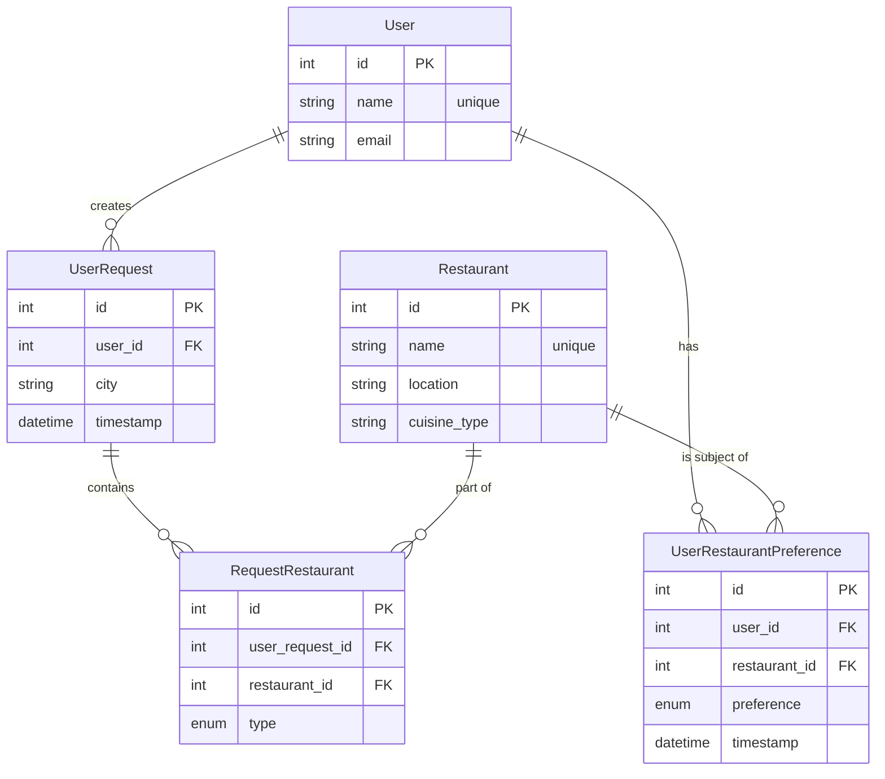

# Campfire Database Schema

This document provides a detailed overview of the database schema used in the Campfire application. The database is designed to store user information, restaurant data, recommendation requests, and user preferences.

## Entity-Relationship Diagram (ERD)

The following diagram illustrates the relationships between the tables in the database.

## Table Definitions

Below are the detailed definitions for each table in the schema.

### `user`

Stores information about each user.

| Column | Type | Constraints | Description |
| :--- | :--- | :--- | :--- |
| `id` | Integer | Primary Key, Autoincrement | Unique identifier for the user. |
| `name` | String(50) | Unique, Not Null | The user's name. |
| `email`| String(120)| Not Null | The user's email address. |

### `restaurant`

A catalog of all restaurants the system knows about.

| Column | Type | Constraints | Description |
| :--- | :--- | :--- | :--- |
| `id` | Integer | Primary Key, Autoincrement | Unique identifier for the restaurant. |
| `name` | String(100)| Unique, Not Null | The restaurant's name. |
| `location`| String(100)| Not Null | The city where the restaurant is located. |
| `cuisine_type`| String(50)| | The type of cuisine served. |

### `user_request`

Logs every recommendation request made by a user.

| Column | Type | Constraints | Description |
| :--- | :--- | :--- | :--- |
| `id` | Integer | Primary Key, Autoincrement | Unique identifier for the request. |
| `user_id`| Integer | Foreign Key to `user.id` | Links to the user who made the request. |
| `city` | String(100)| Not Null | The city for the recommendation request. |
| `timestamp`| DateTime | Default: current time | When the request was made. |

### `request_restaurant`

A linking table that connects `user_request` and `restaurant`, specifying which restaurants were part of a single request.

| Column | Type | Constraints | Description |
| :--- | :--- | :--- | :--- |
| `id` | Integer | Primary Key, Autoincrement | Unique identifier for this link. |
| `user_request_id` | Integer | Foreign Key to `user_request.id` | Links to the specific user request. |
| `restaurant_id` | Integer | Foreign Key to `restaurant.id` | Links to the restaurant. |
| `type` | Enum | Not Null | "input" or "recommendation". |

### `user_restaurant_preference`

Tracks a user's specific preferences for a restaurant.

| Column | Type | Constraints | Description |
| :--- | :--- | :--- | :--- |
| `id` | Integer | Primary Key, Autoincrement | Unique identifier for the preference. |
| `user_id` | Integer | Foreign Key to `user.id` | Links to the user. |
| `restaurant_id`| Integer | Foreign Key to `restaurant.id` | Links to the restaurant. |
| `preference`| Enum | Not Null | "like", "dislike", or "neutral". |
| `timestamp`| DateTime | Default: current time | When the preference was last updated. |
| - | Unique | - | A user can only have one preference per restaurant. | 