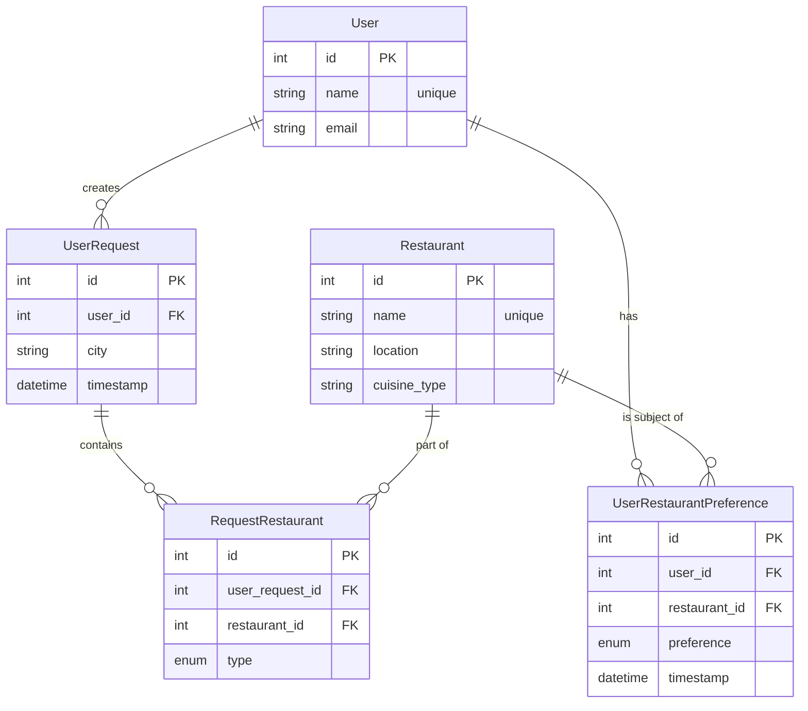

# Campfire Database Schema

This document provides a detailed overview of the database schema used in the Campfire application. The database is designed to store user information, restaurant data, recommendation requests, and user preferences.

## Entity-Relationship Diagram (ERD)

The following diagram illustrates the relationships between the tables in the database.



## Table Definitions

Below are the detailed definitions for each table in the schema.

### `user`

Stores information about each user.

| Column | Type | Constraints | Description |
| :--- | :--- | :--- | :--- |
| `id` | Integer | Primary Key, Autoincrement | Unique identifier for the user. |
| `name` | String(50) | Unique, Not Null | The user's name. |
| `email`| String(120)| Not Null | The user's email address. |

### `restaurant`

A catalog of all restaurants the system knows about.

| Column | Type | Constraints | Description |
| :--- | :--- | :--- | :--- |
| `id` | Integer | Primary Key, Autoincrement | Unique identifier for the restaurant. |
| `name` | String(100)| Unique, Not Null | The restaurant's name. |
| `location`| String(100)| Not Null | The city where the restaurant is located. |
| `cuisine_type`| String(50)| | The type of cuisine served. |

### `user_request`

Logs every recommendation request made by a user.

| Column | Type | Constraints | Description |
| :--- | :--- | :--- | :--- |
| `id` | Integer | Primary Key, Autoincrement | Unique identifier for the request. |
| `user_id`| Integer | Foreign Key to `user.id` | Links to the user who made the request. |
| `city` | String(100)| Not Null | The city for the recommendation request. |
| `timestamp`| DateTime | Default: current time | When the request was made. |

### `request_restaurant`

A linking table that connects `user_request` and `restaurant`, specifying which restaurants were part of a single request.

| Column | Type | Constraints | Description |
| :--- | :--- | :--- | :--- |
| `id` | Integer | Primary Key, Autoincrement | Unique identifier for this link. |
| `user_request_id` | Integer | Foreign Key to `user_request.id` | Links to the specific user request. |
| `restaurant_id` | Integer | Foreign Key to `restaurant.id` | Links to the restaurant. |
| `type` | Enum | Not Null | "input" or "recommendation". |

### `user_restaurant_preference`

Tracks a user's specific preferences for a restaurant.

| Column | Type | Constraints | Description |
| :--- | :--- | :--- | :--- |
| `id` | Integer | Primary Key, Autoincrement | Unique identifier for the preference. |
| `user_id` | Integer | Foreign Key to `user.id` | Links to the user. |
| `restaurant_id`| Integer | Foreign Key to `restaurant.id` | Links to the restaurant. |
| `preference`| Enum | Not Null | "like", "dislike", or "neutral". |
| `timestamp`| DateTime | Default: current time | When the preference was last updated. |
| - | Unique | - | A user can only have one preference per restaurant. |

# Database Configuration Guide

## Overview
Campfire uses PostgreSQL as its primary database, with different configurations for development, staging, and production environments.

## Environment Configuration
The application uses environment variables to determine which database to connect to:

```python
ENVIRONMENT = os.getenv('FLASK_ENV', 'development')

if ENVIRONMENT == 'production':
    DATABASE_URL = os.getenv('POSTGRES_URL') or os.getenv('DATABASE_URL')
elif ENVIRONMENT == 'staging':
    DATABASE_URL = os.getenv('STAGING_DATABASE_URL')
else:
    # Development environment
    DATABASE_URL = os.getenv('DEV_DATABASE_URL') or os.getenv('STAGING_DATABASE_URL') or 'sqlite:////tmp/restaurant_recommendations.db'
```

Required environment variables:
- `FLASK_ENV`: Set to 'development', 'staging', or 'production'
- `DATABASE_URL` or `POSTGRES_URL`: Production database URL
- `STAGING_DATABASE_URL`: Staging database URL
- `DEV_DATABASE_URL`: Development database URL (optional, falls back to SQLite)

## Database Schema

### Restaurant Table
The restaurant table has evolved to support external service integrations (Google Places, Yelp):

```sql
CREATE TABLE restaurant (
    id SERIAL PRIMARY KEY,
    name VARCHAR(100) NOT NULL,
    location VARCHAR(100) NOT NULL,
    cuisine_type VARCHAR(200),  -- Increased from 50 to support longer types
    provider VARCHAR(20) NOT NULL DEFAULT 'google',
    place_id VARCHAR(128) NOT NULL DEFAULT 'manual',
    slug VARCHAR(200) NOT NULL DEFAULT 'default',
    CONSTRAINT uq_restaurant_provider_place UNIQUE (provider, place_id),
    CONSTRAINT uq_restaurant_slug UNIQUE (slug)
);
```

Key changes:
- `cuisine_type` length increased to 200 characters to support compound types (e.g., "restaurant, bar, food, point_of_interest")
- Added `provider` field to track the source (e.g., 'google', 'yelp')
- Added `place_id` for external service reference
- Added `slug` for URL-friendly identifiers
- Unique constraints on (provider, place_id) pair and slug

### User Table
```sql
CREATE TABLE user (
    id SERIAL PRIMARY KEY,
    name VARCHAR(80) UNIQUE NOT NULL,
    email VARCHAR(120) UNIQUE NOT NULL
);
```

### User Request Table
```sql
CREATE TABLE user_request (
    id SERIAL PRIMARY KEY,
    user_id INTEGER NOT NULL REFERENCES user(id),
    timestamp TIMESTAMP DEFAULT CURRENT_TIMESTAMP,
    city VARCHAR(100)
);
```

### Request Restaurant Table
```sql
CREATE TABLE request_restaurant (
    id SERIAL PRIMARY KEY,
    user_request_id INTEGER NOT NULL REFERENCES user_request(id),
    restaurant_id INTEGER NOT NULL REFERENCES restaurant(id),
    type request_type NOT NULL  -- Enum: 'input' or 'recommendation'
);
```

## Migrations
Database migrations are managed using Flask-Migrate (Alembic). Key migrations:

1. Initial Migration (`c9e344f09bd8_initial_migration.py`):
   - Created base tables and relationships
   - Set initial column sizes

2. Cuisine Type Length (`2024_03_14_01`):
   - Increased cuisine_type from VARCHAR(50) to VARCHAR(200)
   - Added to support longer compound types from external services

3. Provider Columns (`2024_03_14_02`):
   - Added provider, place_id, and slug columns
   - Added unique constraints
   - Removed unique constraint on name

To run migrations:
```bash
# Set environment
export FLASK_ENV=staging  # or production

# Run migrations
flask db upgrade
```

## Testing Database Connections
A test script (`test_db.py`) is provided to verify database connectivity and schema:

```bash
# Set Python path to include project root
export PYTHONPATH=/path/to/campfire

# Run tests
FLASK_ENV=staging python test_db.py
```

## Common Issues and Solutions

### Protocol Handling
The application automatically converts 'postgres://' to 'postgresql://' in database URLs:
```python
if DATABASE_URL.startswith('postgres://'):
    DATABASE_URL = DATABASE_URL.replace('postgres://', 'postgresql://', 1)
```

### Supabase Integration
For production environments using Supabase:
```python
if ENVIRONMENT == 'production':
    SUPABASE_URL = os.getenv('SUPABASE_URL', '')
    SUPABASE_KEY = os.getenv('SUPABASE_KEY', '')
    
    if not all([SUPABASE_URL, SUPABASE_KEY]):
        raise ValueError("Missing required Supabase credentials")
```

## Development Guidelines

1. Always create migrations for schema changes:
   ```bash
   flask db migrate -m "description of changes"
   ```

2. Test migrations on staging before production:
   ```bash
   FLASK_ENV=staging flask db upgrade
   ```

3. Use the test_db.py script to verify changes:
   ```bash
   FLASK_ENV=staging python test_db.py
   ```

4. When adding new fields that interact with external services:
   - Consider field length requirements
   - Add appropriate default values
   - Update relevant model validations
   - Test with actual API responses 